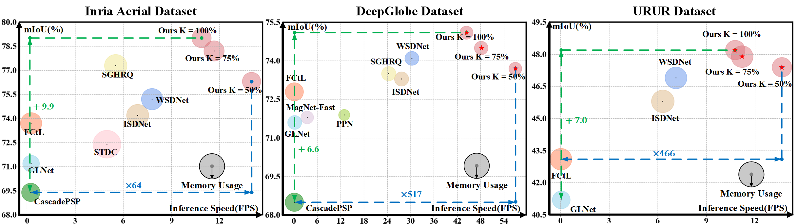
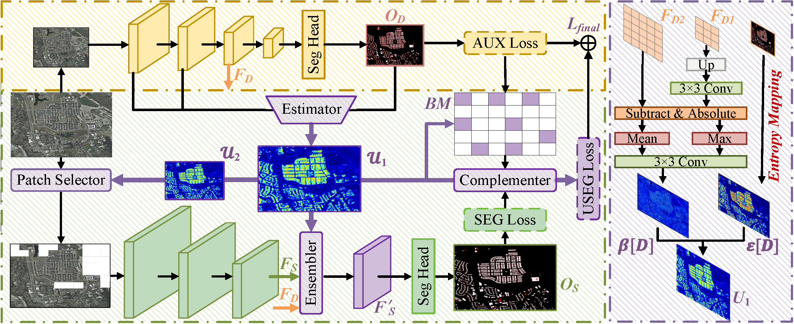

<h1 align="center"> Boosting the Dual-Stream Architecture in Ultra-High Resolution Segmentation with Resolution-Biased Uncertainty Estimation </h1>

  <a href="https://qinrong-nku.github.io/">Rong Qin</a>,
  Xingyu Liu,
  <a herf="https://jingleishi.github.io/">Jinglei Shi</a>,
  Liang Lin,
  <a href="https://cv.nankai.edu.cn/">Jufeng Yang</a>,

 CVPR 2025 

## Abstract

Over the last decade, significant efforts have been dedicated to designing efficient models for the challenge of ultra-high resolution (UHR) semantic segmentation. These models mainly follow the dual-stream architecture and generally fall into three subcategories according to the improvement objectives, i.e., dual-stream ensemble, selective zoom, and omplementary learning. However, most of them overly concentrate on crafting complex pipelines to pursue one of the above objectives separately, limiting the model performance in both accuracy and inference consumption.In this paper, we suggest simultaneously achieving these objectives by estimating resolution-biased uncertainties in low resolution stream. Here, the resolution-biased uncertainty refers to the degree of prediction unreliability primarily caused by resolution loss from down-sampling operations.Specifically, we propose a dual-stream UHR segmentation framework, where an estimator is used to assess resolution-biased uncertainties through the entropy map and high-frequency feature residual. The framework also includes a selector, an ensembler, and a complementer to boost the model with obtained estimations.They share the uncertainty estimations as the weights to choose difficult regions as the inputs for UHR stream, perform weighted fusion between distinct streams, and enhance the learning for important pixels, respectively.Experiment results demonstrate that our method achieves a satisfactory balance between accuracy and inference consumption against other state-of-the-art (SOTA) methods.

## UHRS Pipeline

  

The red regions are the incorrectly predicted ones. 
We first down-sample the UHR image and input it into the low-resolution stream to extract context features and coarse predictions. The context features and coarse predictions are used to compute the resolution bias and entropy map, respectively, which are ultimately combined as the resolution-biased uncertainty estimation. The resolution-biased uncertainty estimation is utilized to boost the UHR stream at multiple aspects through an uncertainty-aware selector, ensembler, and an uncertainty-based complementer.

## 1. Requirements

Python 3.8+, Pytorch 1.9.0, Cuda 11.1, , opencv-python

## 2. Training & Testing

- model training:

    `bash ./tools/dist_train.sh config_file K (GPU number)`
  
- model evaluation:

    `python tools/test.py config_file checkpoints_file --eval mIoU`
    `python tools/fps_test.py config_file --height height of the test image --width width of the test image`

- Set experiment settings:
     
    browse `config` folder

    
